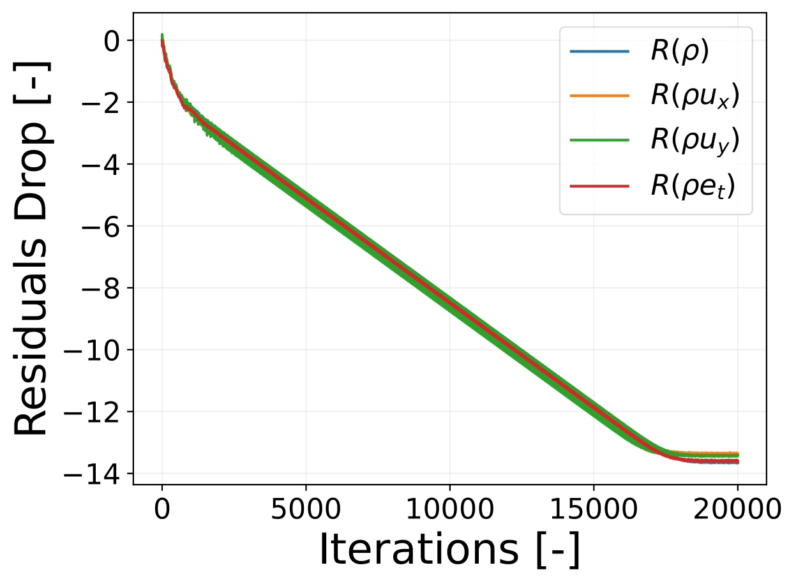
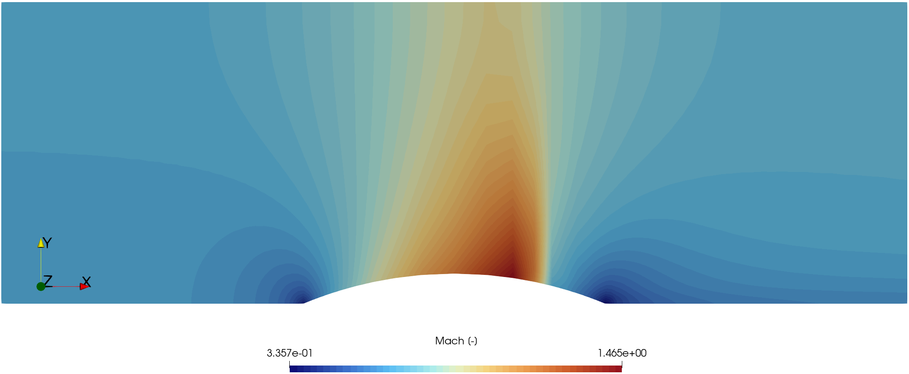
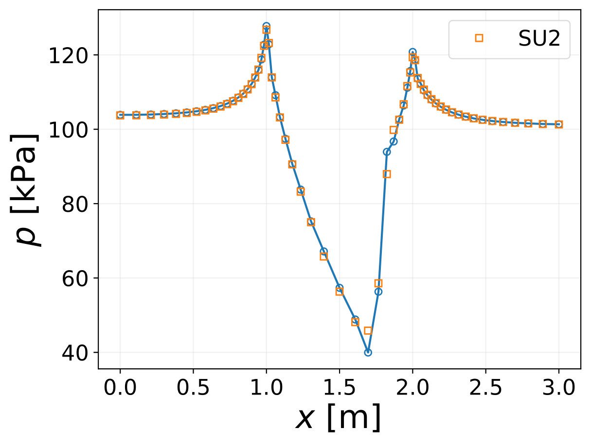
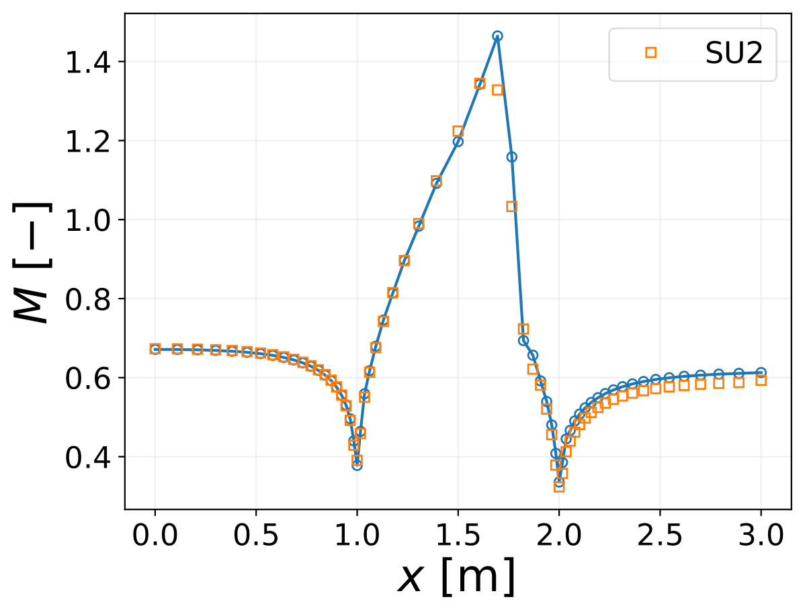

# TurboBFM #


### What is this repository for? ###

* Resolution of inviscid fluid dynamics problems (2D, Axisymmetric and 3D)
* Simulation of turbomachinery flows through the concept of body force models


### How do I get set up? ###

* Git clone the present folder in your system

* Generate a conda python environment with the needed packages using the YAML file
```bash
conda env create -f turbo_bfm.yml
```

* Activate the new environment:
```bash
conda activate turbo_bfm
```

* Navigate to the package and and install it:
```bash
cd TurboBFM
pip install . -e
```

* Navigate to the test cases (TurboBFM/Run) folder (or create one), and run the main.py file for one of the cases:
```bash
python main.py
```

* The input parameters are specified inside every `intput.ini` file, and should be quite easy to comprehend and modify. The content of input files
can be taken from the testcases folder, or alternatively checking the Config.py class.


### Notes ###
* The code has been written for Mac OS systems, so there is the chance for some path-related commands to not run correctly
on windows based machines. It should be quite easy to fix.

* The system of Euler equations is solved with explicit methods (3rd or 4th order Runge-Kutta). This means that the time-step must be accurately restricted below certain limits, and a large number of iterations may be required to simulate a certain problem. The first thing to do when a simulation fails, is to try reducing the `CFL_MAX` input parameter. 


### Results Example ###

##### Inviscid transonic flow over a circular bump #####
Test case for inviscid transonic flow, compared with SU2 results.
Flow field:




Comparison with SU2 Euler Solver results:




### Contribution guidelines ###

* Validate the modifications by means of detailed test cases
* Push the code

### Authors and contacts ###

- **Francesco Neri**, TU Delft, `f.neri@tudelft.nl`


